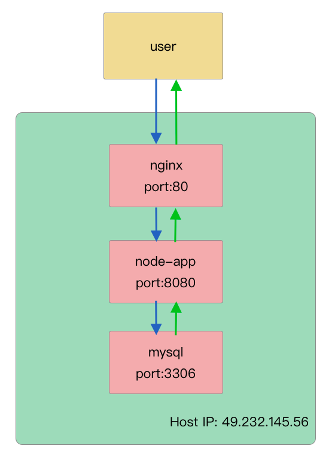

#  version_controller_store


## Architecture




### project structure

```text
egg-project
├── package.json
├── app.js
├── app
|   ├── router.js
│   ├── controller
│   |   └── info.js
│   ├── service
│   |   └── info.js
│   ├── core
│   |   └── base_controller.js
│   ├── validate (request params custom validate)
│   |   └── date.js
│   ├── public
├── config
|   ├── plugin.js
|   ├── config.default.js (default config)
│   ├── config.prod.js  (production config)
|   ├── config.local.js (development config)
└── test
```


## api example
```bash
# create info

url: http://49.232.145.56/api/v1/info

method: POST

request body:
{
  "customKey": "444"
}

response body:
{
  "success": true,
  "data": {
    "key": "customKey",
    "value": "444",
    "timestamp": "2020-11-02T14:18:47.000Z"
  }
}

# get info by key

url: http://49.232.145.56/api/v1/info/customKey
method: GET
response body:
{
  "success": true,
  "data": {
    "value": "444"
  }
}

# get info by key and timestamp

url: http://49.232.145.56/api/v1/info/customKey?timestamp=1604321589
method: GET
response body:
{
  "success": true,
  "data": {
    "value": "111"
  }
}
```

## tips

My cloud host is slow, if the api have any question, please contact me.